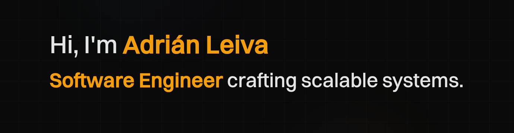

I'm a Software Engineer focused on scalable systems, architecture and infrastructure.

Currently working on:
- Distributed backend systems
- Developer tooling
- Infrastructure & observability
- Product-oriented side projects

> More info at [whos.leivaa.dev](https://whos.leivaa.dev)

---

## Stack

TypeScript • Node.js • Express • Docker • MongoDB • PostgreSQL • Redis • RabbitMQ

---

## Contact

- Website: [whos.leivaa.dev](https://whos.leivaa.dev)
- LinkedIn: [Adrián Leiva Rojano](linkedin.com/in/adrianleivarojano)
- X: [@leivaa21_](x.com/Leivaa21_)
- Email: adrianleivasoftware@gmail.com